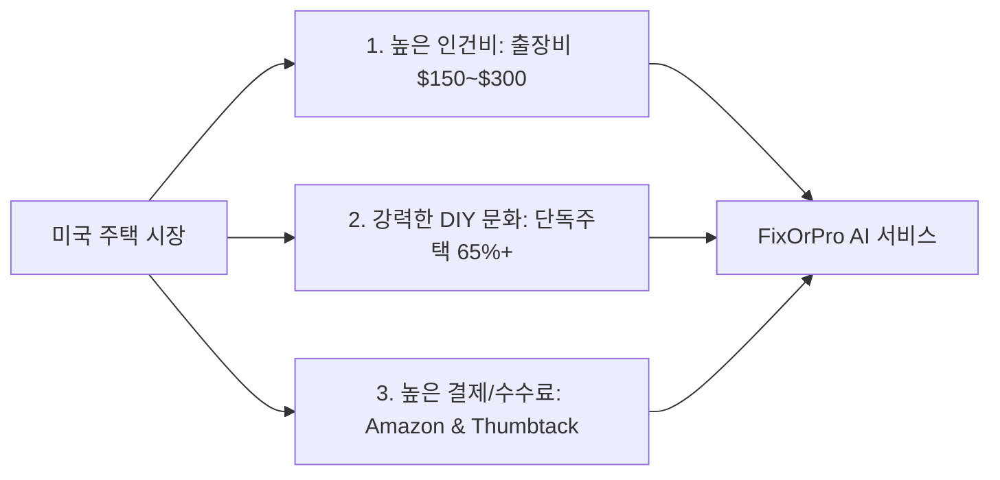
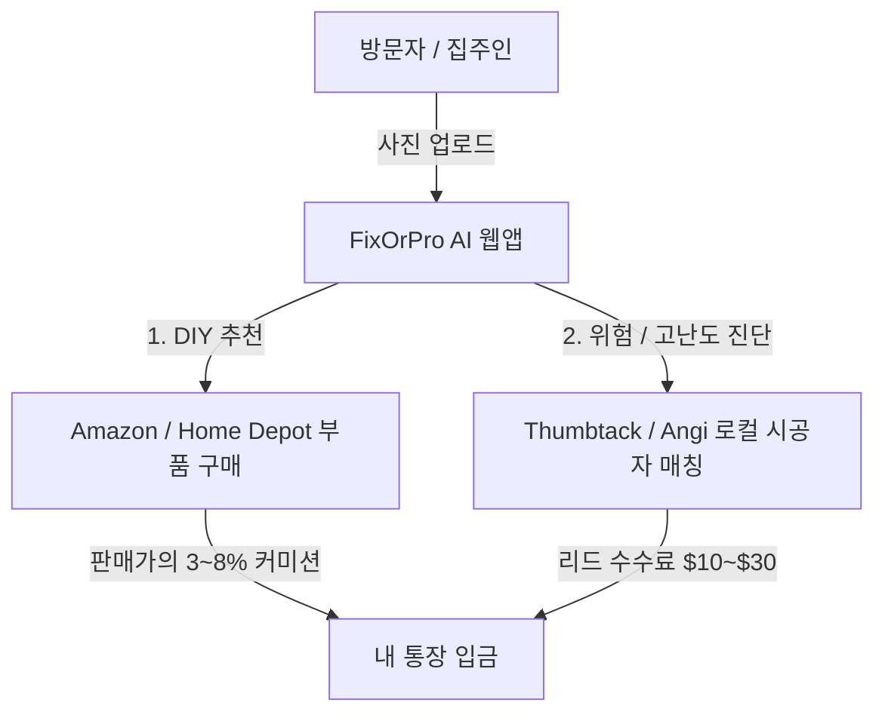
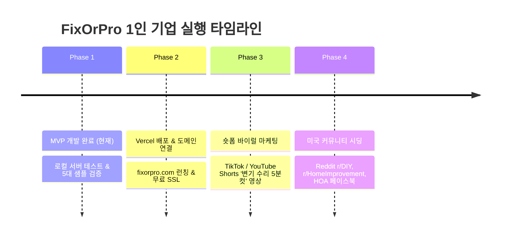

# 🛠️ FixOrPro: AI 기반 미국 1인 기업 (집수리·하자 진단 서비스)

> [!summary] 핵심 가치 제안 (Value Proposition)
> **"Don't spend $200 on a contractor for a $15 fix."**  
> 미국 주택 소유자 및 세입자가 고장 난 부위(변기, 디스포저, 벽 구멍, 싱크대 배관 등) 사진을 찍어 올리면, **Gemini Vision AI**가 5초 만에 하자를 진단하고, **DIY 가능 여부 / 적정 수리비 / 부품 구매 링크**를 제공하는 원스톱 마이크로 SaaS.

---

## 🗺️ 1. 비즈니스 모델 및 미국 시장 선정 이유

### 🇺🇸 왜 미국 시장인가?
1. **극단적인 인건비 격차**: 수도꼭지 패킹 교체나 변기 고무마개 교체 같은 5분짜리 작업도 기술자를 부르면 기본 출장비(Trip Fee) 포함 **$150~$250** 청구.
2. **거대한 DIY 수요**: 주택 구조(드라이월, 목조, 배관 규격)가 표준화되어 있어 자가 수리 시도 비율이 매우 높음.
3. **어필리에이트(제휴 수익) 인프라**: Amazon Associates 및 Home Depot을 통한 자재/공구 구매 전환율이 매우 높음.

---

## 💰 2. 수익화(Monetization) 엔진

### ① 아마존 어소시에이트 (Amazon Associates)
* **작동 원리**: 추천 부품 링크에 나의 고유 **Tracking ID (예: `fixorpro-20`)** 장착.
* **24시간 장바구니 혜택 (쿠키)**: 손님이 $15짜리 변기 부품 링크를 타고 갔다가, 24시간 내에 다른 가전제품($500)을 함께 결제해도 **전체 금액에 대한 수수료가 내 계좌로 입금**.

### ② 로컬 컨트랙터 리드 매칭 (Local Pro Referral)
* 위험하거나 기술자가 필요한 공정(240V 고전압, 가스관, 온수기 폭발 위험 등)은 **Thumbtack / Angi / Yelp**로 1-Click 연결하여 시공자 매칭 수수료 획득.

---

## 🏗️ 3. 기술 스택 및 서비스 아키텍처

| 계층 | 기술 | 역할 |
| :--- | :--- | :--- |
| **Backend** | **Python (FastAPI + Uvicorn)** | 비동기 API 서버, 멀티모달 이미지 처리, CORS 및 정적 파일 호스팅 |
| **AI Engine** | **Google Gemini 2.5 Flash API** | 초고속 멀티모달 비전 분석, 미국 주택 규격/인건비 기준 정형 JSON 출력 |
| **Frontend** | **HTML5 + Modern CSS + Vanilla JS** | 글래스모피즘 UI, 모바일 카메라 즉시 촬영, 탭 네비게이션, 인쇄/PDF 저장 |
| **Package** | **uv** | 초고속 Python 패키지 및 가상환경 관리 |

---

## 🔑 4. 핵심 키(Key) 및 계정 관리 가이드

> [!info] Google Gemini API Key
> * **역할**: 구글의 초고성능 AI 두뇌를 내 웹사이트에 연결하는 만능 디지털 출입증.
> * **발급처**: [Google AI Studio](https://aistudio.google.com/app/apikey) (구글 계정으로 100% 무료 발급).
> * **보안 & 변경**: 언제든지 원할 때 새 키를 5초 만에 생성하거나 기존 키 삭제 가능. 내가 지우지 않는 한 영구 유지.
> * **운영 방식**:
>   - *로컬 테스트 시*: 우측 상단 `⚙️ Settings` 모달에 입력하여 브라우저에 안전 저장.
>   - *실제 운영(배포) 시*: 서버 환경변수(`.env`)에 등록하여 방문자들은 키 입력 없이 무료/유료로 사용.

> [!info] Amazon Associates Store ID
> * **역할**: 아마존에서 내 추천 링크를 식별하여 수수료를 정산해 주는 고유 계좌 아이디.
> * **발급처**: [Amazon Associates US](https://affiliate-program.amazon.com) (무료 가입).
> * **형태**: `yourname-20` (보통 뒤에 `-20`이 붙음).

---

## 📋 5. 탑재된 5대 즉시 체험 데모 시나리오

1. 🚽 **Running Toilet (변기 물소리 지속)**: 고무 플래퍼 노후화 진단 ➡️ **$175 절약** ($8 DIY vs $150 Pro)
2. ⚙️ **Garbage Disposal Jam (디스포저 웅- 소리)**: 이물질 걸림 및 안전 스위치 리셋 ➡️ **$160 절약**
3. 🧱 **Drywall Door Knob Hole (문손잡이 벽 구멍)**: 알루미늄 패치 & 메쉬 보수 ➡️ **$220 절약**
4. 🚰 **Sink P-Trap Leak (싱크대 하부 배관 누수)**: 슬립 조인트 와셔 교체 ➡️ **$195 절약**
5. 🔥 **Water Heater Rust (온수기 하부 부식)**: 🚨 **Call a Pro 위험 판정** (50갤런 침수 및 감전/가스 위험)

---

## 🚀 6. 1인 기업 런칭 & 마케팅 실행 로드맵

### 💡 숏폼 바이럴 콘텐츠 공식
* **Hook (0~3초)**: *"A plumber wanted $250 to fix this hissing toilet... Watch this."*
* **Body (3~12초)**: FixOrPro 웹앱에 사진 촬영 ➡️ AI가 $8짜리 고무 플래퍼 사라고 알려줌 ➡️ 부품 교체 5분 컷
* **CTA (12~15초)**: *"Save hundreds before calling a pro. Link in bio!"*

---

## 📂 7. 로컬 프로젝트 파일 위치
* **작업 디렉토리**: `c:\Users\loveh\1인 기업`
* **실행 명령어**: `uv run uvicorn app.main:app --port 8000`
* **접속 주소**: `http://127.0.0.1:8000`

---
*기록일자: 2026-09-03 | 작성: Antigravity AI Pair Programmer*
