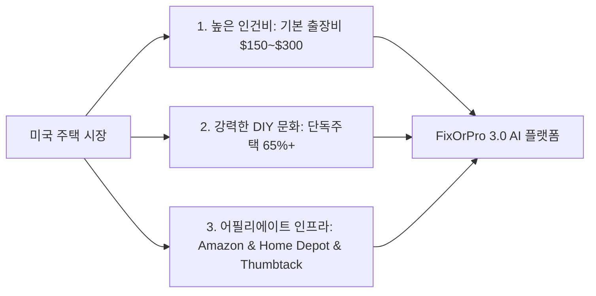
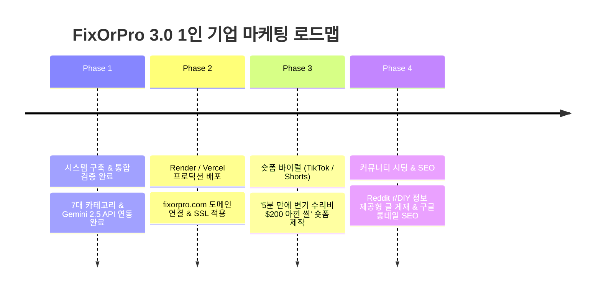

# 🛠️ FixOrPro 3.0: AI 기반 미국 1인 기업 (집수리·하자 진단 서비스)

> [!summary] 핵심 가치 제안 (Value Proposition)
> **"Don't spend $200 on a contractor for a $15 fix."**  
> 미국 주택 소유자 및 세입자가 고장 난 부위(변기, 디스포저, 벽 구멍, 싱크대 배관 등) 사진을 찍어 올리거나 증상을 입력하면, **Google Gemini 2.5 Flash Vision AI**가 5초 만에 하자를 진단하고, **DIY 가능 여부(Verdict) / 적정 수리비 / 1-Click 부품 구매 링크 / 전문가 매칭**을 제공하는 원스톱 마이크로 SaaS.

---

## 🗺️ 1. 비즈니스 모델 및 미국 시장 선정 이유



### 🇺🇸 왜 미국 시장인가?
1. **극단적인 인건비 격차**: 수도꼭지 패킹 교체나 변기 고무마개 교체 같은 5분짜리 작업도 기술자를 부르면 기본 출장비(Trip Fee) 포함 **$150~$250** 청구.
2. **거대한 DIY 수요**: 주택 구조(드라이월, 목조, 배관 규격)가 표준화되어 있어 자가 수리 시도 비율이 높으며, 하드웨어 점포(Home Depot, Lowe's) 접근성이 우수함.
3. **높은 구매 전환율**: 추천 부품 및 공구 구매 시 Amazon 및 Home Depot 어필리에이트 수수료 수익 구조 창출 가능.

---

## 💰 2. 수익화(Monetization) 엔진

```mermaid
flowchart TD
    User[방문자 / 집주인] -->|사진 업로드 / 텍스트 입력| FixOrPro[FixOrPro 3.0 AI 웹앱]
    FixOrPro -->|1. DIY 추천| Amz[Amazon / Home Depot 1-Click 부품 구매]
    Amz -->|판매가의 3~8% 커미션 + 당일 매장 수령(BOPIS)| Wallet[통장 입금]
    FixOrPro -->|2. 위험 / 고난도 진단| Pro[Thumbtack / Angi / Yelp 로컬 시공자 매칭]
    Pro -->|리드 수수료 $10~$30| Wallet
```

### ① 아마존 어소시에이트 & 홈디포 어필리에이트 (Amazon & Home Depot)
* **자동 어필리에이트 태그 주입**: AI가 진단한 추천 부품/공구 키워드에 고유 **Tracking ID (예: `tag=fixorpro-20`)** 장착.
* **24시간 장바구니 쿠키 혜택**: 손님이 $15짜리 변기 부품 링크를 클릭한 후 24시간 내에 다른 가전/공구를 결제해도 전체 결제액에 대한 수수료 지급.
* **Home Depot BOPIS (Buy Online, Pick Up In Store)**: 당일 긴급 배관 누수 수리가 필요한 미국 사용자를 위한 당일 매장 수령 링크 제공.

### ② 로컬 컨트랙터 리드 매칭 (Local Pro Referral)
* 위험하거나 전문가 필수 공정(240V 고전압, 가스관, 온수기 하부 부식 폭발 위험 등)은 **Thumbtack / Angi / Yelp**로 1-Click 연결하여 리드 수수료 획득.

---

## 🏗️ 3. 기술 스택 및 서비스 아키텍처

| 계층 | 기술 | 역할 |
| :--- | :--- | :--- |
| **Backend** | **Python (FastAPI + Uvicorn)** | 비동기 API 서버, 멀티모달 이미지/텍스트 분석, 정적 파일 호스팅 및 CORS 처리 |
| **AI Engine** | **Google Gemini 2.5 Flash API** | `google-genai` SDK 사용, 초고속 비전 분석, 2026 US 수리비/인건비 기준 정형 JSON 출력 |
| **Frontend** | **HTML5 + Modern CSS + Vanilla JS** | Glassmorphism UI, 7대 카테고리 Hub Grid, 1-2-3-4 진단 위저드, 인쇄/PDF 저장 |
| **Hosting & Deploy**| **Render / Vercel** | `render.yaml` zero-config 배포, 자동 SSL 및 가비지 콜렉션 관리 |
| **Package** | **uv** | 초고속 Python 패키지 및 가상환경 관리 |

---

## 🔑 4. 핵심 키(Key) 보안 및 백엔드 프록시 정책

> [!info] Google Gemini API Key 보안 정책
> * **서버 프록시 쉴드 (Proxy Shield)**: 사용자 브라우저에 API 키가 노출되지 않도록, 백엔드 서버 환경변수(`.env`)의 `GEMINI_API_KEY`를 통해 안전하게 API 호출.
> * **클라이언트 커스텀 키 모달**: 사용자가 직접 본인의 Gemini Key를 설정하려는 경우 `⚙️ Settings` 모달을 통해 `localStorage`에 암호화 저장 가능.

> [!info] Amazon Associates Store ID & Home Depot Tag
> * **역할**: 아마존 및 홈디포 어필리에이트 정산 아이디.
> * **운영 방식**: 백엔드/클라이언트 링크 생성기에서 `fixorpro-20` 파라미터를 자동 결합.

---

## 🧩 5. FixOrPro 3.0 카테고리 허브 & 1-2-3-4 진단 위저드

1. **7대 카테고리 허브 Grid**
   - 🚰 **주방/욕실 배관**: 싱크대, 세면대, P-트랩 누수
   - 🚽 **변기 & 하수관**: 수조 소음, 플래퍼, 오수 누수
   - 🔥 **온수기 & 보일러**: 배수 밸브, T&P 밸브, 탱크
   - ⚡ **전기 & 스위치**: 콘센트, 차단기, 전등 불꽃
   - 🧱 **석고보드 & 외벽**: 실내 석고 구멍, 외벽 스타코
   - 🚪 **방문 & 경첩**: 문틀 걸림, 도어락, 경첩 수리
   - 🛠️ **기타 확장 수리**: 에어컨/HVAC, 대형가전, 차고문, 지붕, 창문

2. **1-2-3-4 단계별 좁혀가기 (Auto-Narrowing Wizard)**
   - 카테고리 선택 또는 증상 검색 시 부품 단위까지 정밀 진단하여 DIY 수리 키트($3.99~$15.99) 및 솔루션 블루프린트 즉시 생성.

3. **Clean Reset Handler & Session Caching**
   - `[✕ 내용 지우기]` 또는 검색어 삭제 시 즉시 리포트 숨김, `sessionStorage` 초기화 및 좁혀가기 모듈 완전 리셋.

---

## 📋 6. 검증 완료된 진단 시나리오 (Verification Results)

| 카테고리 | 진단 케이스 | 판정 (Verdict) | 절약 예상 비용 |
| :--- | :--- | :--- | :--- |
| 🚰 배관 | 싱크대 P-트랩 와셔 노후 누수 | `DIY_RECOMMENDED` | **$195 절약** ($5 DIY vs $200 Pro) |
| 🚽 변기 | 수조 고무 플래퍼 노후화 & 체인 꼬임 | `DIY_RECOMMENDED` | **$175 절약** ($8 DIY vs $180 Pro) |
| 🔥 온수기 | 온수기 내벽 부식 및 배수 밸브 파손 | 🚨 `CALL_A_PRO` | 전문가 필수 (폭발/침수 위험) |
| ⚡ 전기 | 스위치 조작 시 불꽃 및 차단기 작동 | 🚨 `CALL_A_PRO` | 전문가 필수 (고전압/화재 위험) |
| 🧱 석고보드 | 문손잡이에 찍힌 2~4인치 벽 구멍 | `DIY_RECOMMENDED` | **$220 절약** ($12 DIY vs $235 Pro) |
| 🚪 방문/경첩 | 문틀 걸림 및 헐거운 경첩 나사 | `DIY_RECOMMENDED` | **$140 절약** ($4 DIY vs $150 Pro) |
| ❄️ HVAC / 가전 | 에어컨 응축수 배수관 막힘 | `DIY_RECOMMENDED` | **$160 절약** ($10 DIY vs $170 Pro) |

---

## 🚀 7. 런칭 & 마케팅 실행 로드맵



### 💡 숏폼 바이럴 콘텐츠 공식
* **Hook (0~3초)**: *"A plumber quoted me $250 for this leaking P-trap... Watch this."*
* **Body (3~12초)**: FixOrPro 웹앱에 사진 찍어 업로드 ➡️ AI가 $4.99짜리 슬립 조인트 와셔 사라고 조언 ➡️ 5분 만에 수리 완료.
* **CTA (12~15초)**: *"Save hundreds before calling a contractor. Link in bio!"*

### 🔍 구글 검색 의도 (Search Intent) SEO 키워드 전략
* `how to fix running toilet hissing sound`
* `sink P-trap leaking under bathroom vanity cost`
* `drywall hole repair DIY kit vs contractor price`

---

## 📂 8. 로컬 프로젝트 구조 및 실행 가이드
* **작업 디렉토리**: `c:\Users\loveh\1인 기업`
* **서버 실행 명령어**: `uv run uvicorn app.main:app --host 127.0.0.1 --port 8000 --reload`
* **접속 주소**: `http://127.0.0.1:8000`

---
*최종 업데이트: 2026-09-03 | 작성: Antigravity AI Pair Programmer*
